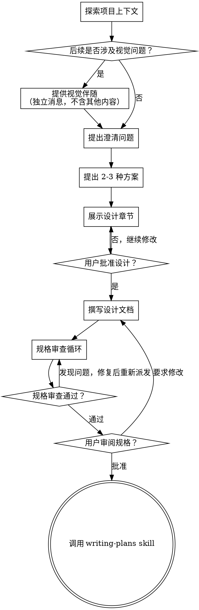

# 把想法打磨成设计

通过自然、协作式对话，把一个模糊想法逐步收敛成完整设计和规格说明。

先理解当前项目上下文，再一次只问一个问题来细化需求。确认你已经理解要构建的内容后，给出设计，并取得用户批准。

<HARD-GATE>
在你展示设计并得到用户批准之前，不要调用任何实现类 skill，不要写代码，不要脚手架项目，也不要采取任何实现动作。无论项目看起来多简单，这条规则都必须执行。
</HARD-GATE>

## 反模式：“这太简单了，不需要设计”

每个项目都要走这个流程。待办清单、单函数工具、配置改动，都一样。越是“看起来简单”的项目，越容易因为未经检查的假设而返工。设计可以很短，但你必须先展示设计并获得批准。

## 检查清单

你必须为以下每一项创建任务，并按顺序完成：

1. **探索项目上下文**：检查文件、文档、最近提交
2. **提供视觉伴随能力**：如果接下来的问题会涉及视觉内容，则单独发送一条消息询问是否启用，不要和澄清问题合并。见下文“视觉伴随”
3. **提出澄清问题**：一次一个，理解目标、约束、成功标准
4. **提出 2 到 3 种方案**：说明取舍并给出推荐
5. **展示设计**：按复杂度拆分章节展示，每一节后都获取用户确认
6. **撰写设计文档**：保存到 `docs/specs/YYYY-MM-DD-<topic>-design.md`
7. **规格审查循环**：派发 `spec-document-reviewer` 子代理，使用精心整理的审查上下文（绝不能传你的会话历史）；发现问题就修复并重新派发，直到通过（最多 3 轮，超过则升级给人工）
8. **让用户审阅已写好的规格文档**：在继续前请用户查看 spec 文件
9. **切换到实现准备**：调用 `writing-plans` skill 创建实现计划

## 流程图

**终止状态是调用 `writing-plans`。** 不要调用 `frontend-design`、`mcp-builder` 或任何其他实现类 skill。完成 brainstorming 后，唯一允许调用的下一步 skill 是 `writing-plans`。

## 具体流程

**理解想法：**

- 先查看当前项目状态，包括文件、文档和最近提交
- 在提细节问题之前，先判断范围：如果请求同时包含多个相互独立的子系统（例如“做一个带聊天、文件存储、计费和分析的平台”），要立刻指出这一点。先拆分，再深入，不要直接细化一个本应先分解的大项目
- 如果项目太大，不适合一份 spec，先帮助用户拆成多个子项目：哪些部分相互独立、它们如何关联、应该按什么顺序做。然后只对第一个子项目走完整的设计流程。每个子项目都要有自己独立的 spec → plan → implementation 周期
- 对于范围合适的项目，一次只问一个问题来收敛想法
- 可以优先使用选择题，但开放式问题也可以
- 每条消息只问一个问题；如果某个主题还要继续深挖，就拆成多轮
- 重点理解：目标、约束、成功标准
- 所有提问、追问、选项和总结都使用简体中文

**探索方案：**

- 提出 2 到 3 种不同方案，并明确说明取舍
- 以对话式方式呈现方案，同时给出你的推荐和理由
- 先给出推荐方案，再解释为什么推荐它

**展示设计：**

- 当你确认自己已经理解要构建什么后，再展示设计
- 每一节长度跟复杂度匹配：简单问题几句话即可，复杂问题可写到 200 到 300 字
- 每展示完一节，都询问用户“目前这样是否正确”
- 覆盖：架构、组件、数据流、错误处理、测试
- 如果某处不清楚，要随时回到澄清阶段
- 设计说明、章节标题、示例、方案比较和最终规格草稿都使用简体中文

**为了隔离性与清晰度而设计：**

- 把系统拆成更小的单元，每个单元只承担一个明确职责，并通过定义清晰的接口通信，以便单独理解和测试
- 对每个单元，都应该能回答：它做什么、如何使用、依赖什么
- 如果别人不读内部实现就无法理解这个单元，或者内部实现稍改就会影响调用方，说明边界没划好
- 小而边界清晰的单元也更利于你自己工作：你对能一次装进上下文的代码推理更稳定，修改也更可靠。文件过大通常意味着职责过多

**在现有代码库中工作：**

- 在提出修改前，先探索当前结构，并遵循现有模式
- 如果现有代码存在会影响本次工作的结构问题（例如文件过大、边界不清、职责缠绕），可以把有针对性的改善纳入设计
- 不要提出与当前目标无关的重构，始终聚焦当前任务

## 设计完成后

**文档：**

- 把已经验证过的设计（spec）写入 `docs/specs/YYYY-MM-DD-<topic>-design.md`
  - 如果用户明确指定了 spec 路径，则以用户偏好为准
- 如果可用，使用 `elements-of-style:writing-clearly-and-concisely` skill 改善文案
- 规格文档正文、标题、表格、说明和待确认项全部使用简体中文

**规格审查循环：**
写完 spec 文档后：

1. 派发 `spec-document-reviewer` 子代理（参见 `spec-document-reviewer-prompt.md`）
2. 如果发现问题，就修复、重新派发，直到通过
3. 如果循环超过 3 轮，升级给人工处理

**用户审阅关口：**
规格审查循环通过后，必须先让用户审阅已写出的 spec，再继续：

> “规格文档已写入 `<path>`。请先审阅它；如果你希望在开始编写实现计划前做任何修改，直接告诉我。”

等待用户回复。如果用户要求修改，就修改并重新走一遍规格审查循环。只有在用户明确批准后，才能继续。

**进入实现：**

- 调用 `writing-plans` skill 创建详细实现计划
- 不要调用任何其他 skill。下一步只能是 `writing-plans`

## 关键原则

- **一次只问一个问题**：不要一次抛给用户太多内容
- **优先选择题**：在可行时比开放题更容易回答
- **严格执行 YAGNI**：从所有设计里去掉不必要功能
- **探索替代方案**：在收敛前始终先给 2 到 3 种方案
- **逐步验证**：先展示设计，拿到批准后再进入下一阶段
- **保持灵活**：如果有地方讲不通，就退回去澄清
- **全程简体中文**：用户可见的问答、设计文档、固定提示语、审查模板与浏览器界面文案全部使用简体中文

## 视觉伴随

这是一个基于浏览器的辅助能力，用来在 brainstorming 过程中展示草图、图表和视觉方案。它是一个工具，不是一种模式。用户接受这个能力，表示在适合的时候可以用浏览器辅助说明；并不代表之后每个问题都必须走浏览器。

**如何提供视觉伴随：** 当你预计接下来会涉及视觉内容（例如草图、布局、图表）时，只询问一次是否启用：

> “我们接下来的一部分内容，如果能在浏览器里直接看到草图、图表或对比图，会更容易沟通。我可以边讨论边给你展示这些视觉稿。这个功能还比较新，而且会多消耗一些上下文。要不要试试？（需要打开一个本地 URL）”

**这条询问必须单独成消息。** 不要和澄清问题、上下文总结或任何其他内容混在一起。这条消息里只能有上面的邀请文案，然后等待用户回复。如果用户拒绝，就继续纯文本 brainstorming。

**按问题决定是否使用浏览器：** 即使用户同意启用，也要对每一个问题单独判断是用浏览器还是终端。判断标准只有一个：**这个内容用户“看见”会不会比“读文字”更容易理解？**

- **使用浏览器**：内容本身就是视觉性的，例如草图、线框图、布局对比、架构图、视觉设计方向对比
- **使用终端**：内容本身是文本性的，例如需求澄清、概念取舍、方案优缺点列表、A/B/C/D 文本选项、范围决策

一个问题“和 UI 有关”并不自动等于“应该走视觉伴随”。例如“这里的产品个性是什么意思？”是概念问题，应在终端里讨论；“这两种向导页布局哪种更合适？”才是视觉问题，更适合在浏览器里展示。

如果用户同意启用视觉伴随，再继续前先阅读详细说明：
`skills/brainstorming/visual-companion.md`
